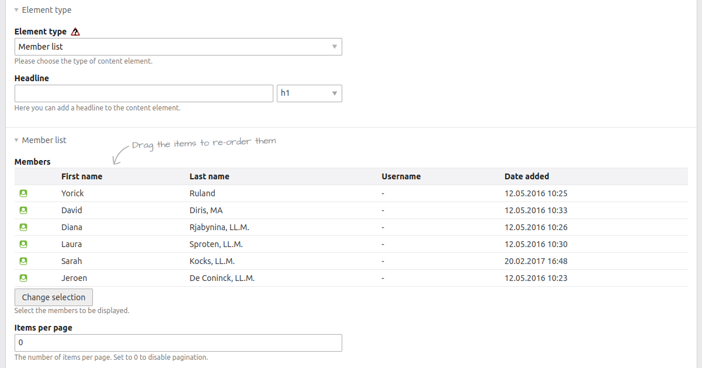

# Contao Member Listing Bundle

[](https://github.com/heimrichhannot/contao-member-listing-bundle)
[](https://packagist.org/packages/heimrichhannot/contao-member-listing-bundle)


This bundle provides a simple content element to list frontend members.



## Feature

- list frontend members based on picker selection
- json-ld added to your response with only the displayed member data
- support for member images

## Usage

### Setup

1. Install via composer or contao manager

    ```bash
    composer require heimrichhannot/contao-member-listing-bundle
    ``` 
   
2. Update database
3. Create a new content element of type "Member list" and configure it as needed.
4. Customize the template `content_element/member_list` to your needs.

### Member images

This bundle comes with support for member images. To use this feature, you need to add an image field (`singleSRC`) to your member dca.
Afterward you get a size selection in the content element configuration.
There are two template bundled with image support.

```php
<?php 
# /contao/dca/tl_member.php
$GLOBALS['TL_DCA']['tl_member']['fields']['singleSRC'] = [
    'exclude'   => true,
    'inputType' => 'fileTree',
    'eval'      => ['filesOnly' => true, 'fieldType' => 'radio', 'mandatory' => true, 'tl_class' => 'clr'],
    'sql'       => "binary(16) NULL",
];
```