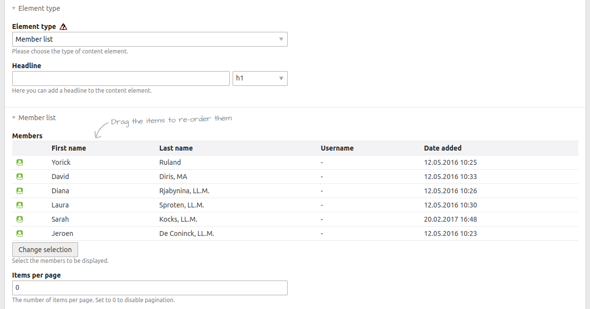

# 👥 Contao Member Listing Bundle

[](https://github.com/heimrichhannot/contao-member-listing-bundle)
[](https://packagist.org/packages/heimrichhannot/contao-member-listing-bundle)


This bundle provides a simple content element to list frontend members.

## Features

- List frontend members
- Choose the members to show with a member picker wizard.
- JSON-LD with the selected member's data included.
- Supports showing member images.

## Installation

Install via composer or contao manager.

```bash
composer require heimrichhannot/contao-member-listing-bundle
``` 

Then, update your database.

## Usage

1. Create a new content element of type "Member list" and configure it as needed.
2. Customize the template `content_element/member_list` to your needs.



### Member images

This bundle comes with support for member images. To use this feature, you need to add an image field (`singleSRC`) to your member dca.
Afterward you get a size selection in the content element configuration.
Two templates with image support are already bundled.

```php
<?php 
# /contao/dca/tl_member.php
$GLOBALS['TL_DCA']['tl_member']['fields']['singleSRC'] = [
    'exclude'   => true,
    'inputType' => 'fileTree',
    'eval'      => ['filesOnly' => true, 'fieldType' => 'radio', 'mandatory' => true, 'tl_class' => 'clr'],
    'sql'       => "binary(16) NULL",
];
```

> For legacy compatibility, you may also add an `addImage` field to your member dca, to toggle the image display on or off.
> This is however discouraged and will be removed in future versions of this bundle.
